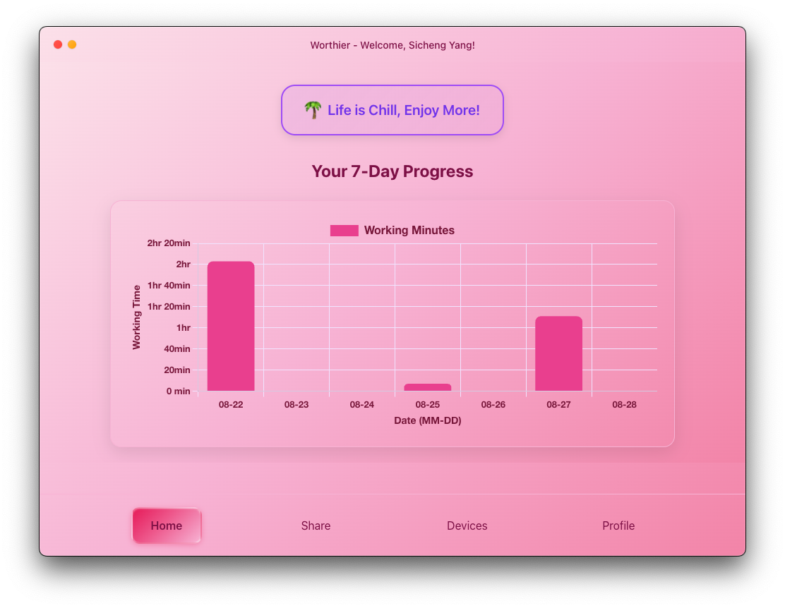
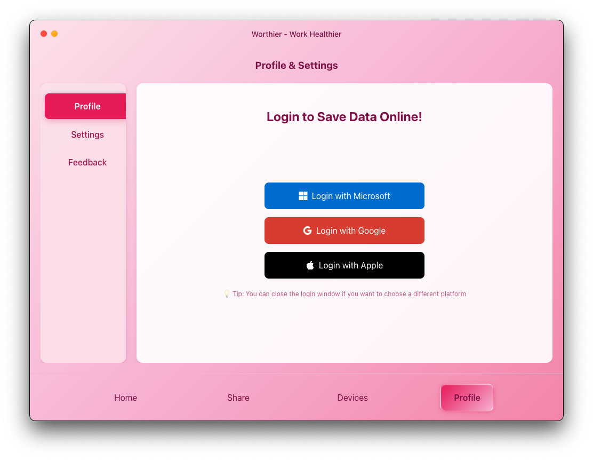
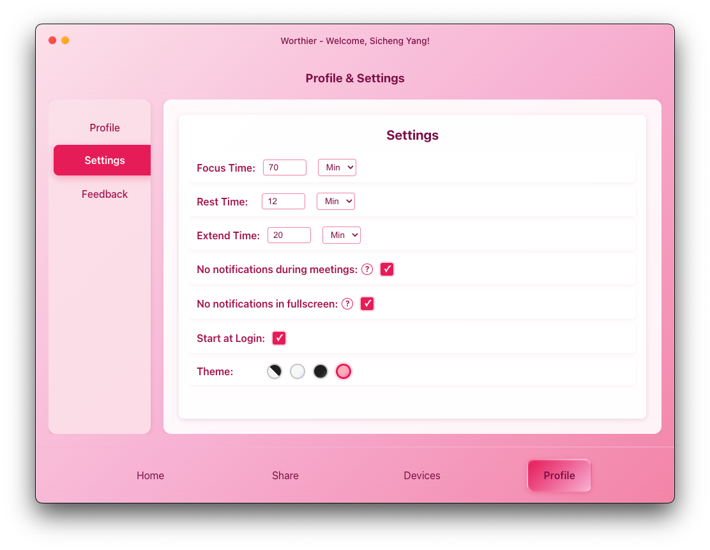
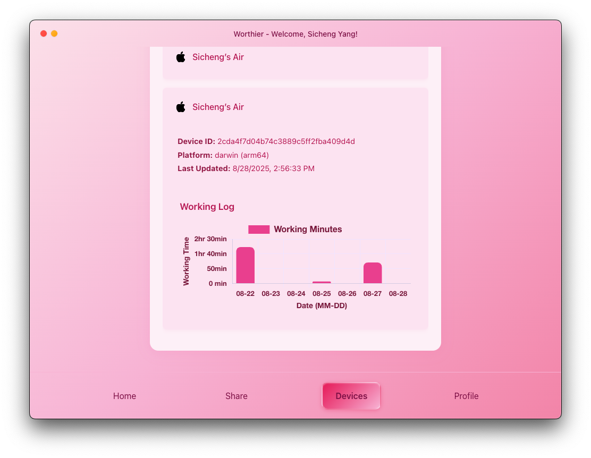
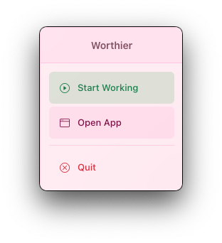
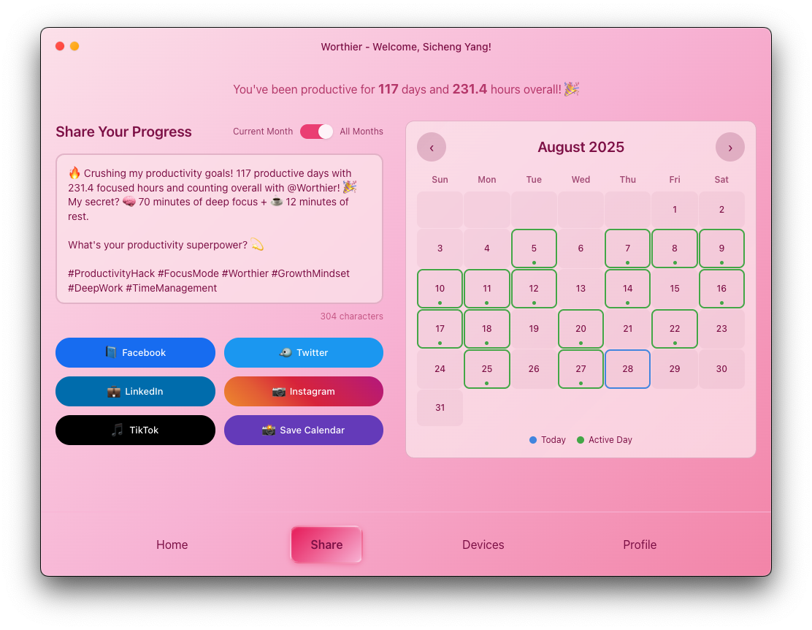

# 🎯 Worthier Desktop - Work Healthier, Focus Better

A beautiful, cross-platform productivity timer application built with Electron and React that helps you maintain healthy work habits and maximize focus.

<div align="center">
  
  <br />
  <em>Transform your work routine with smart timing and healthy breaks</em>
</div>

## ✨ Key Features

### � **Beautiful Main Interface**
Clean, intuitive design that keeps you focused without distractions.



- **Smart Timer Display**: Clear visual feedback on your current work session
- **Elegant Mac-Style Controls**: Native window controls with traffic light buttons
- **Real-time Progress**: See your productivity at a glance
- **Minimal Distraction**: Clean interface that stays out of your way

### 🔐 **Seamless Authentication**
Multiple login options for secure, personalized experience.



- **Multi-Provider Support**: Login with Microsoft, Google, or Apple
- **Secure Token Management**: Encrypted credential storage
- **Auto-Login**: Remember your preferences across sessions
- **Privacy First**: Your data stays local and secure

### ⚙️ **Comprehensive Settings**
Customize every aspect to fit your workflow perfectly.



- **Flexible Timer Configuration**: Set focus, break, and extension times
- **Theme Selection**: Light, dark, and pink themes
- **Smart Notifications**: Disable during presentations or meetings
- **Privacy Controls**: Full control over permissions and data

### 📱 **Multi-Device Management**
Track and manage all your connected devices effortlessly.



- **Device Overview**: See all your connected devices at a glance
- **Cross-Platform Sync**: Seamless experience across macOS, Windows, and Linux
- **Device-Specific Settings**: Customize behavior for each device
- **Real-time Status**: Monitor activity across all your devices

### 🚀 **Quick System Tray Access**
Stay productive without interrupting your workflow.



- **Always Accessible**: Quick access from your system tray
- **Instant Timer Control**: Start, pause, or stop sessions instantly
- **Background Operation**: Continues working when window is closed
- **Native Integration**: Feels like a natural part of your system

### 🤝 **Easy Sharing & Collaboration**
Share your productivity insights and connect with others.



- **Progress Sharing**: Share your productivity achievements
- **Export Data**: Export your work logs and statistics
- **Social Features**: Connect with colleagues and friends
- **Motivational Feedback**: Celebrate your productivity milestones

## 🎨 **Design Philosophy**

Worthier Desktop is built with a focus on:
- **Simplicity**: Clean, uncluttered interface
- **Native Feel**: Platform-specific optimizations
- **Health First**: Encourages healthy work habits
- **Privacy**: Your data belongs to you

## � **Technology Stack**

- **Frontend**: React 19 with modern hooks
- **Backend**: Electron 37 with Node.js
- **Build Tools**: Vite for fast development
- **UI Framework**: Bootstrap 5 with custom styling
- **Cross-Platform**: Native support for macOS, Windows, Linux

## 🚀 **Features Overview**

| Feature | Description | Status |
|---------|-------------|---------|
| 🎯 **Pomodoro Timer** | Customizable focus sessions | ✅ Available |
| 🔔 **Smart Notifications** | Context-aware notifications | ✅ Available |
| 🎨 **Multiple Themes** | Light, dark, and pink themes | ✅ Available |
| 👤 **Multi-Auth** | Microsoft, Google, Apple login | ✅ Available |
| 📱 **Cross-Platform** | macOS, Windows, Linux support | ✅ Available |
| 🔒 **Secure Storage** | Encrypted credential storage | ✅ Available |
| 📊 **Progress Tracking** | Detailed productivity analytics | ✅ Available |
| 🤝 **Data Sharing** | Export and share capabilities | ✅ Available |

## 🎯 **Use Cases**

### 👩‍💻 **For Developers**
- Focus sessions during coding
- Break reminders to prevent burnout
- Multi-device synchronization

### 📚 **For Students**
- Study session management
- Exam preparation timing
- Healthy study habits

### 🏢 **For Professionals**
- Meeting-aware notifications
- Presentation mode support
- Cross-team productivity sharing

### 🏠 **For Remote Workers**
- Home office productivity
- Work-life balance maintenance
- Distraction management

## 🛡️ **Privacy & Security**

- **Local-First**: All data stored locally on your device
- **Encrypted Storage**: Credentials encrypted with system keychain
- **No Tracking**: Zero analytics or user tracking
- **Minimal Permissions**: Only requests necessary system access
- **Open Source**: Full transparency in code and practices

## 🤝 **Contributing**

We welcome contributions! Here's how to get started:

1. **Fork** the repository
2. **Create** a feature branch (`git checkout -b feature/amazing-feature`)
3. **Commit** your changes (`git commit -m 'Add amazing feature'`)
4. **Push** to the branch (`git push origin feature/amazing-feature`)
5. **Open** a Pull Request

### Development Guidelines
- Follow ESLint configurations
- Test on multiple platforms
- Update documentation for new features
- Maintain backwards compatibility

## 📞 **Support & Community**

- 🐛 **Bug Reports**: [GitHub Issues](https://github.com/SichengYang/Worthier-Desktop/issues)
- 💬 **Discussions**: [GitHub Discussions](https://github.com/SichengYang/Worthier-Desktop/discussions)
- 📧 **Contact**: [Project Maintainer](mailto:sicheng@worthier.app)

## 📄 **License**

This project is licensed under the ISC License - see the [LICENSE](LICENSE) file for details.

## 🙏 **Acknowledgments**

Special thanks to:
- The Electron team for the amazing framework
- React community for continuous innovation
- Bootstrap team for excellent UI components
- All contributors and users who make Worthier better

---

<div align="center">
  <strong>Made with ❤️ for productive, healthy work</strong>
  <br>
  <em>Start your journey to better work habits today!</em>
</div>

## Technology Stack

### Backend (Electron Main Process)
- **Electron 37.2.0**: Cross-platform desktop application framework
- **Node.js**: JavaScript runtime with native modules
- **Keytar**: Secure credential storage
- **Axios**: HTTP client for authentication

### Frontend (React)
- **React 19.1.0**: Modern UI library with hooks
- **Vite**: Fast build tool and development server
- **Bootstrap 5.3.7**: UI components and styling
- **Bootstrap Icons**: Comprehensive icon library

### Build Tools
- **Electron Forge**: Application packaging and distribution
- **Electron Builder**: Alternative build system for releases
- **ESLint**: Code quality and consistency

## Project Structure

```
worthier-desktop/
├── main.js                    # Main Electron process
├── package.json              # Node.js dependencies and scripts
├── forge.config.js           # Electron Forge configuration
├── build.js                  # Custom build script
│
├── Core Modules/
├── ├── autologin.js          # Authentication and auto-login logic
├── ├── timer.js              # Timer worker process
├── ├── tokenManager.js       # Secure token storage and encryption
├── ├── settingsManager.js    # App settings persistence
├── ├── notificationManager.js # Smart notification system
├── ├── notificationWindow.js # React notification windows
├── ├── trayWindow.js         # System tray interface
├── ├── theme.js              # Theme management
├── └── login.js              # OAuth login handlers
│
├── UI Components/
├── ├── preload.js            # Electron-React bridge
├── ├── notificationPreload.js # Notification window bridge
├── └── renderer.js           # Legacy renderer (deprecated)
│
├── React Main App/
├── react/
├── ├── src/
├── │   ├── App.jsx           # Main application component
├── │   ├── Login.jsx         # Authentication interface
├── │   ├── Profile.jsx       # User profile and settings
├── │   ├── Content.jsx       # Main content area
├── │   ├── Menu.jsx          # Navigation menu
├── │   ├── Title.jsx         # Application title bar
├── │   ├── UserGuide.jsx     # First-time user onboarding
├── │   ├── SettingsWindow.jsx # Settings configuration
├── │   ├── ProfileWindow.jsx # User profile display
├── │   ├── FeedbackWindow.jsx # User feedback system
├── │   ├── TrayMenu.jsx      # System tray menu
├── │   ├── ThemeContext.jsx  # Theme state management
├── │   └── UserContext.jsx   # User state management
├── ├── package.json          # React app dependencies
├── ├── vite.config.js        # Vite build configuration
├── └── dist/                 # Built React application
│
├── React Notifications/
├── notification-react/
├── ├── src/App.jsx           # Notification window component
├── ├── package.json          # Notification dependencies
├── ├── vite.config.js        # Notification build config
├── └── dist/                 # Built notification system
│
├── Development Tools/
├── ├── reset-app.js          # Development reset utility
├── └── notificationUsageExamples.js # API documentation
│
└── Assets/
    ├── icon.png              # Application icon
    ├── iconTemplate.png      # Template icon for tray
    └── electron/             # Electron-specific resources
```

### App Settings
Settings are automatically saved to:
- **macOS**: `~/Library/Application Support/worthier-desktop/`
- **Windows**: `%APPDATA%/worthier-desktop/`
- **Linux**: `~/.config/worthier-desktop/`

## Security Features

### Token Management
- **Encryption**: All tokens are encrypted using system keychain
- **Auto-expiration**: Tokens are validated on startup
- **Secure Storage**: Uses native credential storage APIs

### Permissions
- **Minimal Permissions**: Only requests necessary system permissions
- **User Control**: Users can disable features requiring permissions
- **Transparency**: Clear indication of what permissions are needed

### Privacy
- **Local Storage**: Settings stored locally on user's device
- **No Tracking**: No analytics or user tracking
- **Data Minimization**: Only essential data is collected

## Troubleshooting

### Common Issues

#### Timer Not Working
- Check if timer process is spawning correctly
- Verify system permissions
- Look for errors in console output

#### Authentication Issues
- Verify internet connectivity
- Check OAuth provider status
- Clear stored tokens: `node reset-app.js`

#### Notification Problems
- Check system notification permissions
- Verify React notification builds are current
- Test with different notification settings

### Logs
Application logs are available in:
- **Console**: Development mode shows detailed logs
- **System Logs**: Check system logs for permission issues
- **Settings**: Enable debug logging in development

## License

This project is licensed under the ISC License - see the [LICENSE](LICENSE) file for details.

## Support

### Getting Help
- **Issues**: Report bugs on [GitHub Issues](https://github.com/SichengYang/Worthier-Desktop/issues)
- **Discussions**: Join discussions on GitHub

### Known Limitations
- Requires internet connection for initial authentication
- Some features require system permissions
- Notification appearance varies by platform

## Acknowledgments

- **Electron Team**: For the excellent desktop app framework
- **React Team**: For the powerful UI library
- **Vite Team**: For the fast build tooling
- **Bootstrap Team**: For the comprehensive UI components

---
